# Contratos de API - Lantui ↔ AgentOS

> **Propósito:** Definir integración entre Lantui (Go TUI) y AgentOS (Agno Framework)  
> **Versión:** 1.0 con AgentOS  
> **Estado:** 🟢 Actualizado para usar AgentOS nativo  
> **Fecha:** Octubre 14, 2025

---

## 🎯 Visión General

**Lantui** se integra con **AgentOS**, la plataforma completa de Agno que proporciona:
- ✅ API RESTful nativa para agentes
- ✅ Gestión de sesiones automática
- ✅ Storage y memoria persistente
- ✅ Multi-agente con coordinación
- ✅ Control Plane web opcional

**Arquitectura:**
```
┌─────────────────┐
│    Lantui       │  Terminal UI moderna (Bubble Tea)
│    (Go TUI)     │  
└────────┬────────┘
         │ HTTP/REST
         ▼
┌─────────────────┐
│    AgentOS      │  FastAPI + Agno Framework
│   (Python)      │  
│                 │
│  ┌───────────┐ │
│  │ Meta Agent│ │  Orquestador principal
│  ├───────────┤ │
│  │ Analyzer  │ │  Analiza solicitudes
│  ├───────────┤ │
│  │ Planner   │ │  Crea planes
│  ├───────────┤ │
│  │ Generator │ │  Genera código
│  └───────────┘ │
│                 │
│  Storage (SQLite)
│  ├─ Sessions
│  ├─ Memory
│  └─ Knowledge
└─────────────────┘
```

---

## 📋 AgentOS - Endpoints Estándar

Lantui consume directamente la API de AgentOS sin modificaciones.

### 1. Health Check

```http
GET /health
```

**Response:**
```json
{
  "status": "ok"
}
```

**Go Client:**
```go
func (c *AgentOSClient) Health(ctx context.Context) error {
    resp, err := c.Get(ctx, "/health")
    if err != nil {
        return fmt.Errorf("health check failed: %w", err)
    }
    return nil
}
```

---

### 2. Configuración del OS

```http
GET /config
```

**Response:**
```json
{
  "os_id": "meta-agent-os-v1",
  "description": "Meta-Agente Generador con AgentOS",
  "databases": [
    {
      "id": "agents_db",
      "type": "sqlite",
      "name": "Agentes Generados"
    }
  ],
  "agents": [
    {
      "id": "meta_agent",
      "name": "Meta-Agente",
      "description": "Orquestador principal del sistema",
      "model": "claude-sonnet-4-20250514"
    },
    {
      "id": "analyzer_agent",
      "name": "Analyzer",
      "description": "Analiza solicitudes y genera preguntas",
      "model": "claude-sonnet-4-20250514"
    },
    {
      "id": "planner_agent",
      "name": "Planner",
      "description": "Crea planes estructurados de agentes",
      "model": "claude-sonnet-4-20250514"
    }
  ],
  "teams": [],
  "workflows": []
}
```

**Go Models:**
```go
type OSConfig struct {
    OSID        string      `json:"os_id"`
    Description string      `json:"description"`
    Databases   []Database  `json:"databases"`
    Agents      []AgentInfo `json:"agents"`
    Teams       []TeamInfo  `json:"teams"`
    Workflows   []Workflow  `json:"workflows"`
}

type AgentInfo struct {
    ID          string `json:"id"`
    Name        string `json:"name"`
    Description string `json:"description"`
    Model       string `json:"model"`
}
```

---

### 3. Chat con Agente

**Flujo principal:** Lantui usa el chat endpoint para interactuar con los agentes del sistema.

```http
POST /agents/{agent_id}/chat
```

**Request:**
```json
{
  "message": "Quiero crear un agente de búsqueda de noticias sobre IA",
  "stream": false,
  "session_id": "optional-uuid"
}
```

**Response:**
```json
{
  "content": "Perfecto, te ayudaré a crear un agente de búsqueda de noticias sobre IA.\n\n¿Qué fuentes de noticias prefieres? Por ejemplo: TechCrunch, MIT Technology Review, ArXiv, etc.",
  "session_id": "550e8400-e29b-41d4-a716-446655440000",
  "agent": "analyzer_agent",
  "timestamp": "2025-10-14T12:00:00Z"
}
```

**Streaming Response (si `stream: true`):**
```
data: {"type":"start","session_id":"550e8400..."}

data: {"type":"content","delta":"Perfecto"}

data: {"type":"content","delta":", te ayudaré"}

data: {"type":"content","delta":" a crear..."}

data: {"type":"end","content":"Perfecto, te ayudaré..."}
```

**Go Models:**
```go
type ChatRequest struct {
    Message   string `json:"message"`
    Stream    bool   `json:"stream"`
    SessionID string `json:"session_id,omitempty"`
}

type ChatResponse struct {
    Content   string    `json:"content"`
    SessionID string    `json:"session_id"`
    Agent     string    `json:"agent"`
    Timestamp time.Time `json:"timestamp"`
}

// Para streaming
type StreamChunk struct {
    Type      string `json:"type"` // "start", "content", "end"
    Delta     string `json:"delta,omitempty"`
    Content   string `json:"content,omitempty"`
    SessionID string `json:"session_id,omitempty"`
}
```

**Go Client Implementation:**
```go
func (c *AgentOSClient) Chat(ctx context.Context, agentID string, req ChatRequest) (*ChatResponse, error) {
    endpoint := fmt.Sprintf("/agents/%s/chat", agentID)
    
    var resp ChatResponse
    err := c.Post(ctx, endpoint, req, &resp)
    if err != nil {
        return nil, fmt.Errorf("chat failed: %w", err)
    }
    
    return &resp, nil
}

func (c *AgentOSClient) ChatStream(ctx context.Context, agentID string, req ChatRequest) (<-chan StreamChunk, error) {
    req.Stream = true
    endpoint := fmt.Sprintf("/agents/%s/chat", agentID)
    
    stream := make(chan StreamChunk)
    
    go func() {
        defer close(stream)
        // SSE streaming implementation
        // ...
    }()
    
    return stream, nil
}
```

---

### 4. Sesiones

```http
GET /sessions?agent_id={agent_id}&limit=10
```

**Response:**
```json
{
  "sessions": [
    {
      "session_id": "550e8400-e29b-41d4-a716-446655440000",
      "agent_id": "meta_agent",
      "created_at": "2025-10-14T12:00:00Z",
      "updated_at": "2025-10-14T12:10:00Z",
      "message_count": 12
    }
  ],
  "total": 1
}
```

```http
GET /sessions/{session_id}
```

**Response:**
```json
{
  "session_id": "550e8400-e29b-41d4-a716-446655440000",
  "agent_id": "meta_agent",
  "messages": [
    {
      "role": "user",
      "content": "Quiero crear un agente...",
      "timestamp": "2025-10-14T12:00:00Z"
    },
    {
      "role": "assistant",
      "content": "Perfecto, te ayudaré...",
      "timestamp": "2025-10-14T12:00:05Z"
    }
  ],
  "created_at": "2025-10-14T12:00:00Z",
  "updated_at": "2025-10-14T12:10:00Z"
}
```

**Go Models:**
```go
type Session struct {
    SessionID    string    `json:"session_id"`
    AgentID      string    `json:"agent_id"`
    Messages     []Message `json:"messages,omitempty"`
    CreatedAt    time.Time `json:"created_at"`
    UpdatedAt    time.Time `json:"updated_at"`
    MessageCount int       `json:"message_count,omitempty"`
}

type Message struct {
    Role      string    `json:"role"` // "user" o "assistant"
    Content   string    `json:"content"`
    Timestamp time.Time `json:"timestamp"`
}
```

---

## 🔧 Extensiones Custom para Meta-Agente

Endpoints adicionales específicos para la funcionalidad de generación de código.

### 1. Generar Código de Agente

```http
POST /api/meta-agent/generate
```

**Propósito:** Generar código Python del agente basado en conversación completada.

**Request:**
```json
{
  "session_id": "550e8400-e29b-41d4-a716-446655440000",
  "options": {
    "include_comments": true,
    "add_examples": true,
    "save_to_file": true
  }
}
```

**Response:**
```json
{
  "code": "\"\"\"\\nAgente de Búsqueda de Noticias IA\\n...\"\"\"\\n\\nfrom agno.agent import Agent\\n...",
  "plan": {
    "nombre": "Buscador de Noticias IA",
    "rol": "Buscar y resumir noticias sobre IA",
    "modelo": "claude-sonnet-4-20250514",
    "nivel": 1,
    "herramientas": ["duckduckgo", "newspaper"],
    "instrucciones": [
      "Buscar noticias recientes sobre IA",
      "Filtrar por fuentes confiables"
    ]
  },
  "filename": "buscador_de_noticias_ia_agent.py",
  "filepath": "generated/agents/buscador_de_noticias_ia_agent.py",
  "lines": 125,
  "size_bytes": 3840
}
```

**Go Models:**
```go
type GenerateRequest struct {
    SessionID string          `json:"session_id"`
    Options   GenerateOptions `json:"options"`
}

type GenerateOptions struct {
    IncludeComments bool `json:"include_comments"`
    AddExamples     bool `json:"add_examples"`
    SaveToFile      bool `json:"save_to_file"`
}

type GenerateResponse struct {
    Code      string    `json:"code"`
    Plan      AgentPlan `json:"plan"`
    Filename  string    `json:"filename"`
    Filepath  string    `json:"filepath"`
    Lines     int       `json:"lines"`
    SizeBytes int       `json:"size_bytes"`
}

type AgentPlan struct {
    Nombre        string   `json:"nombre"`
    Rol           string   `json:"rol"`
    Modelo        string   `json:"modelo"`
    Nivel         int      `json:"nivel"`
    Herramientas  []string `json:"herramientas"`
    Instrucciones []string `json:"instrucciones"`
    EjemploUso    string   `json:"ejemplo_uso"`
}
```

---

### 2. Generar con Streaming

```http
POST /api/meta-agent/generate-stream
```

**Request:** Igual que `/generate`

**Response (SSE):**
```
data: {"type":"start","stage":"analyzing"}

data: {"type":"progress","stage":"planning","percentage":20}

data: {"type":"progress","stage":"generating_imports","percentage":40}

data: {"type":"code_chunk","content":"\"\"\"\\nAgente de..."}

data: {"type":"progress","stage":"generating_config","percentage":60}

data: {"type":"code_chunk","content":"\\nfrom agno..."}

data: {"type":"progress","stage":"writing_file","percentage":90}

data: {"type":"complete","filename":"agent.py","lines":125}
```

**Go Models:**
```go
type GenerateEvent struct {
    Type       string  `json:"type"` // "start","progress","code_chunk","complete","error"
    Stage      string  `json:"stage,omitempty"`
    Percentage int     `json:"percentage,omitempty"`
    Content    string  `json:"content,omitempty"`
    Filename   string  `json:"filename,omitempty"`
    Lines      int     `json:"lines,omitempty"`
    Error      string  `json:"error,omitempty"`
}
```

---

### 3. Listar Agentes Generados

```http
GET /api/meta-agent/generated?limit=20&offset=0
```

**Response:**
```json
{
  "agents": [
    {
      "filename": "buscador_de_noticias_ia_agent.py",
      "filepath": "generated/agents/buscador_de_noticias_ia_agent.py",
      "plan": {
        "nombre": "Buscador de Noticias IA",
        "rol": "Buscar noticias sobre IA"
      },
      "created_at": "2025-10-14T12:15:00Z",
      "size_bytes": 3840,
      "lines": 125
    }
  ],
  "total": 15,
  "limit": 20,
  "offset": 0
}
```

---

## 🏗️ Implementación Backend (Python)

### Estructura del AgentOS

```python
# agentos.py (archivo principal)

from agno.agent import Agent
from agno.models.anthropic import Claude
from agno.os import AgentOS
from agno.storage.agent import SqliteAgentStorage

# Agentes del sistema
analyzer_agent = Agent(
    name="Analyzer Agent",
    role="Analizar solicitudes y generar preguntas aclaratorias",
    model=Claude(id="claude-sonnet-4-20250514"),
    instructions=[
        "Analiza la solicitud del usuario",
        "Identifica información faltante",
        "Genera preguntas específicas y relevantes",
        "Mantén conversación natural y amigable"
    ],
    markdown=True,
)

planner_agent = Agent(
    name="Planner Agent",
    role="Crear planes estructurados de agentes AI",
    model=Claude(id="claude-sonnet-4-20250514"),
    instructions=[
        "Crea un plan JSON estructurado del agente",
        "Define nombre, rol, nivel, herramientas e instrucciones",
        "Asegura que el plan sea completo y ejecutable"
    ],
    markdown=False,
    response_model=AgentPlan,  # Pydantic model
)

# Storage compartido
storage = SqliteAgentStorage(
    table_name="agent_sessions",
    db_file="agents_memory.sqlite"
)

# Configurar AgentOS
agent_os = AgentOS(
    os_id="meta-agent-os-v1",
    description="Meta-Agente Generador con AgentOS",
    agents=[analyzer_agent, planner_agent],
    storage=storage,
)

# Añadir rutas custom
from fastapi import APIRouter
from src.infrastructure.api.meta_routes import router as meta_router

agent_os.app.include_router(meta_router, prefix="/api/meta-agent")

# Servir
if __name__ == "__main__":
    agent_os.serve("agentos:app", reload=True, port=7777)
```

### Rutas Custom

```python
# src/infrastructure/api/meta_routes.py

from fastapi import APIRouter, HTTPException
from fastapi.responses import StreamingResponse
from pydantic import BaseModel
from typing import List, Optional
import asyncio

from src.application.services.meta_agent import MetaAgent
from src.infrastructure.templates.agent_templates import AgentTemplate

router = APIRouter()
meta_agent_service = MetaAgent()

class GenerateRequest(BaseModel):
    session_id: str
    options: dict = {}

class GenerateResponse(BaseModel):
    code: str
    plan: dict
    filename: str
    filepath: str
    lines: int
    size_bytes: int

@router.post("/generate", response_model=GenerateResponse)
async def generate_agent(req: GenerateRequest):
    """Generar código del agente desde una sesión completada."""
    try:
        # Obtener conversación de la sesión
        session = await get_session(req.session_id)
        
        # Extraer plan de la conversación
        plan = meta_agent_service.extract_plan_from_session(session)
        
        # Generar código
        template = AgentTemplate()
        code = template.generate(plan)
        
        # Guardar archivo
        filepath = f"generated/agents/{plan.nombre.lower().replace(' ', '_')}_agent.py"
        with open(filepath, 'w', encoding='utf-8') as f:
            f.write(code)
        
        return GenerateResponse(
            code=code,
            plan=plan.model_dump(),
            filename=os.path.basename(filepath),
            filepath=filepath,
            lines=len(code.split('\n')),
            size_bytes=len(code.encode('utf-8'))
        )
    
    except Exception as e:
        raise HTTPException(status_code=500, detail=str(e))

@router.post("/generate-stream")
async def generate_agent_stream(req: GenerateRequest):
    """Generar código con streaming de progreso."""
    async def event_generator():
        try:
            yield f"data: {json.dumps({'type': 'start', 'stage': 'analyzing'})}\n\n"
            await asyncio.sleep(0.5)
            
            # Obtener sesión
            session = await get_session(req.session_id)
            yield f"data: {json.dumps({'type': 'progress', 'stage': 'planning', 'percentage': 20})}\n\n"
            
            # Extraer plan
            plan = meta_agent_service.extract_plan_from_session(session)
            yield f"data: {json.dumps({'type': 'progress', 'stage': 'generating', 'percentage': 40})}\n\n"
            
            # Generar código en chunks
            template = AgentTemplate()
            code = template.generate(plan)
            
            chunk_size = 200
            for i in range(0, len(code), chunk_size):
                chunk = code[i:i+chunk_size]
                yield f"data: {json.dumps({'type': 'code_chunk', 'content': chunk})}\n\n"
                await asyncio.sleep(0.1)
            
            # Guardar
            yield f"data: {json.dumps({'type': 'progress', 'stage': 'writing_file', 'percentage': 90})}\n\n"
            filepath = save_agent_file(plan, code)
            
            # Completado
            yield f"data: {json.dumps({'type': 'complete', 'filename': os.path.basename(filepath), 'lines': len(code.split('\\n'))})}\n\n"
        
        except Exception as e:
            yield f"data: {json.dumps({'type': 'error', 'error': str(e)})}\n\n"
    
    return StreamingResponse(event_generator(), media_type="text/event-stream")

@router.get("/generated")
async def list_generated_agents(limit: int = 20, offset: int = 0):
    """Listar agentes generados."""
    # Implementación...
    pass
```

---

## 🧪 Testing

### Mock AgentOS Client (Go)

```go
// internal/client/mock_agentos.go

type MockAgentOSClient struct {
    ChatResponses map[string]*ChatResponse
    Delay         time.Duration
}

func NewMockClient() *MockAgentOSClient {
    return &MockAgentOSClient{
        ChatResponses: map[string]*ChatResponse{
            "analyzer_agent": {
                Content:   "¿Qué tipo de agente quieres crear?",
                SessionID: "mock-session-123",
                Agent:     "analyzer_agent",
            },
        },
        Delay: 100 * time.Millisecond,
    }
}

func (m *MockAgentOSClient) Chat(ctx context.Context, agentID string, req ChatRequest) (*ChatResponse, error) {
    time.Sleep(m.Delay)
    
    if resp, ok := m.ChatResponses[agentID]; ok {
        return resp, nil
    }
    
    return &ChatResponse{
        Content:   "Mock response for: " + req.Message,
        SessionID: "mock-session-" + uuid.New().String(),
        Agent:     agentID,
    }, nil
}
```

---

## 📊 Flujo Completo: Usuario → Agente Generado

```mermaid
sequenceDiagram
    participant U as Usuario (Lantui)
    participant OS as AgentOS
    participant A as Analyzer Agent
    participant P as Planner Agent
    participant G as Generator

    U->>OS: POST /agents/analyzer_agent/chat
    Note right of U: "Crear agente de noticias"
    
    OS->>A: Run with message
    A->>OS: Response + questions
    OS->>U: ¿Qué fuentes prefieres?
    
    U->>OS: POST /agents/analyzer_agent/chat (session_id)
    Note right of U: "TechCrunch, MIT Review"
    
    OS->>A: Continue conversation
    A->>OS: Más preguntas...
    OS->>U: ¿Frecuencia de búsqueda?
    
    Note over U,A: ... más preguntas ...
    
    U->>OS: POST /agents/planner_agent/chat
    Note right of U: Conversación completa
    
    OS->>P: Create plan from conversation
    P->>OS: AgentPlan JSON
    OS->>U: Plan estructurado
    
    U->>U: Usuario confirma plan
    
    U->>OS: POST /api/meta-agent/generate
    OS->>G: Generate code(plan)
    G->>G: Create Python file
    G->>OS: Code + metadata
    OS->>U: Success + filepath
    
    Note over U: ✨ Agente generado!
```



---

## ✅ Checklist de Integración

### Backend (Python + AgentOS)
- [ ] Crear archivo `agentos.py` principal
- [ ] Configurar `analyzer_agent` y `planner_agent`
- [ ] Setup `SqliteAgentStorage` para sesiones
- [ ] Crear router custom `/api/meta-agent`
- [ ] Implementar endpoint `/generate`
- [ ] Implementar endpoint `/generate-stream`
- [ ] Tests de endpoints

### Frontend (Go + Lantui)
- [ ] Crear interface `AgentOSClient`
- [ ] Implementar `HTTPClient` con AgentOS API
- [ ] Implementar `MockClient` para desarrollo
- [ ] Chat flow con streaming
- [ ] Gestión de sesiones
- [ ] UI para confirmación de plan
- [ ] Integration tests end-to-end

---

## 🚀 Próximos Pasos

1. **Backend:** Adaptar `meta_agent.py` para funcionar dentro de AgentOS
2. **Backend:** Crear rutas custom en `meta_routes.py`
3. **Frontend:** Implementar cliente Go para AgentOS API
4. **Frontend:** Prototipar pantalla de chat con analyzer_agent
5. **Testing:** Setup mock AgentOS para desarrollo paralelo

---

**Última actualización:** Octubre 14, 2025  
**Estado:** 🟢 Actualizado para AgentOS  
**Próxima revisión:** Implementación de agentos.py

