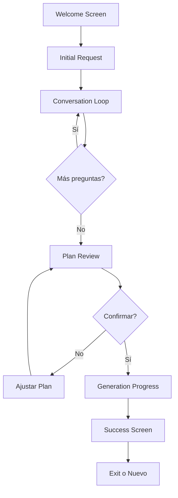

# Plan de Desarrollo - Lantui CLI

> **Proyecto:** Frontend TUI (Text User Interface) para Meta-Agente Generador
> **Versión:** 1.0
> **Stack:** Go 1.21+, Bubble Tea, Lipgloss, Charm Suite
> **Inspiración:** Claude Code, Gemini Code, GitHub CLI, Charm Glow

---

## 🎯 Visión del Proyecto

Lantui es la interfaz CLI moderna y hermosa para el Meta-Agente Generador. Proporciona una experiencia interactiva, fluida y visualmente atractiva para crear agentes AI personalizados, siguiendo las últimas tendencias en herramientas de terminal de IA.

### Objetivos Principales

1. **Experiencia de Usuario Excepcional:** Interfaz intuitiva, responsive y con feedback visual rico
2. **Performance:** Respuesta instantánea, streaming de contenido, sin bloqueos
3. **Estética Moderna:** Diseño limpio, colores atractivos, animaciones suaves
4. **Desarrollo Paralelo:** Arquitectura desacoplada que permite evolución independiente del backend
5. **Extensibilidad:** Fácil añadir nuevas vistas, comandos y funcionalidades

---

## 🏗️ Arquitectura del Frontend

### Estructura del Proyecto

```
lantui/
├── cmd/
│   └── lantui/
│       └── main.go              # Entry point
│
├── internal/
│   ├── app/
│   │   ├── app.go               # Aplicación principal (Bubble Tea)
│   │   └── state.go             # Estado global
│   │
│   ├── ui/
│   │   ├── components/          # Componentes reutilizables
│   │   │   ├── header.go
│   │   │   ├── footer.go
│   │   │   ├── input.go
│   │   │   ├── list.go
│   │   │   ├── progress.go
│   │   │   └── markdown.go
│   │   │
│   │   ├── screens/             # Pantallas principales
│   │   │   ├── welcome.go
│   │   │   ├── conversation.go
│   │   │   ├── plan_review.go
│   │   │   ├── generation.go
│   │   │   └── success.go
│   │   │
│   │   └── styles/              # Estilos y temas
│   │       ├── theme.go
│   │       ├── colors.go
│   │       └── layouts.go
│   │
│   ├── client/                  # Cliente para backend
│   │   ├── client.go            # Interface
│   │   ├── grpc.go              # Implementación gRPC
│   │   ├── http.go              # Implementación HTTP
│   │   └── mock.go              # Mock para desarrollo
│   │
│   ├── models/                  # Modelos de dominio
│   │   ├── agent_plan.go
│   │   ├── conversation.go
│   │   └── generation.go
│   │
│   └── config/                  # Configuración
│       ├── config.go
│       └── flags.go
│
├── pkg/
│   └── utils/                   # Utilidades compartidas
│       ├── markdown.go
│       └── validation.go
│
├── proto/                       # Definiciones gRPC (compartidas)
│   └── meta_agent.proto
│
├── assets/                      # Assets estáticos
│   ├── logo.txt
│   └── help.md
│
├── go.mod
├── go.sum
├── Makefile
├── Taskfile.yml
└── README.md
```

### Stack Tecnológico

#### Core Framework
- **Bubble Tea** (v0.27+): Framework TUI con arquitectura Elm
- **Lipgloss** (v0.13+): Estilos y layout para terminales
- **Bubbles** (v0.18+): Componentes TUI pre-construidos

#### Charm Suite
- **Glamour** (v0.7+): Renderizado de Markdown
- **Log** (v0.4+): Logging con colores
- **Huh** (v0.4+): Formularios interactivos avanzados

#### Comunicación
- **gRPC-Go** (v1.60+): Cliente gRPC para backend
- **Viper** (v1.18+): Configuración
- **Cobra** (v1.8+): CLI framework (opcional, para comandos)

#### Desarrollo
- **Air** (v1.52+): Live reload para desarrollo
- **golangci-lint** (v1.55+): Linting
- **testify** (v1.9+): Testing

---

## 🎨 Diseño de la Experiencia

### Flujo de Pantallas



### Pantallas Principales

#### 1. Welcome Screen
```
╭──────────────────────────────────────────────────────────╮
│                                                          │
│     🤖  Meta-Agente Generador de Agentes AI             │
│                                                          │
│     Crea agentes AI personalizados con Agno              │
│     Framework más rápido • Más simple • Más potente      │
│                                                          │
│     [Presiona ENTER para comenzar]                       │
│     [Ctrl+C para salir]                                  │
│                                                          │
╰──────────────────────────────────────────────────────────╯
```

**Características:**
- Logo ASCII art animado
- Gradiente de colores (cyan → purple)
- Fade-in suave
- Información del sistema (versión, config)

#### 2. Conversation Screen
```
╭─ Conversación ────────────────────────────────────────╮
│                                                        │
│ 🤖 Meta-Agente:                                       │
│ ┌──────────────────────────────────────────────────┐ │
│ │ ¿Qué tipo de agente quieres crear?               │ │
│ │                                                   │ │
│ │ Describe su propósito y funcionalidad...         │ │
│ └──────────────────────────────────────────────────┘ │
│                                                        │
│ 👤 Tú:                                                │
│ ┌──────────────────────────────────────────────────┐ │
│ │ █                                                 │ │
│ └──────────────────────────────────────────────────┘ │
│                                                        │
│ [Tab: Ayuda] [↑↓: Historial] [Ctrl+C: Cancelar]      │
╰────────────────────────────────────────────────────────╯
```

**Características:**
- Mensajes con streaming (efecto typewriter)
- Syntax highlighting para código
- Markdown renderizado en tiempo real
- Historial de conversación navegable
- Auto-guardado de contexto

#### 3. Plan Review Screen
```
╭─ Plan del Agente ─────────────────────────────────────╮
│                                                        │
│ 📋 Nombre: Asistente de Análisis de Datos            │
│ 🎯 Rol: Analizar datasets y generar insights         │
│ 🧠 Modelo: Claude Sonnet 4                           │
│ 📊 Nivel: 2 (Con memoria)                            │
│                                                        │
│ 🛠️  Herramientas:                                     │
│   • Python Tools                                      │
│   • File Tools                                        │
│   • Web Search                                        │
│                                                        │
│ 📝 Instrucciones:                                     │
│   1. Analizar estructura de datos                    │
│   2. Identificar patrones y anomalías                │
│   3. Generar visualizaciones                         │
│                                                        │
│ [ ✓ Confirmar ]  [ ✎ Editar ]  [ ✗ Cancelar ]        │
╰────────────────────────────────────────────────────────╯
```

**Características:**
- Tabla estructurada con bordes redondeados
- Íconos para cada sección
- Navegación por teclado (Tab, Enter)
- Vista previa en tiempo real
- Edición inline opcional

#### 4. Generation Progress Screen
```
╭─ Generando Agente ────────────────────────────────────╮
│                                                        │
│ ⚙️  Compilando estructura...                          │
│ ████████████████░░░░░░░░░░░░░░░░ 45%                 │
│                                                        │
│ ✓ Imports generados                                   │
│ ✓ Configuración del modelo                           │
│ ⟳ Configurando herramientas...                       │
│ ○ Escribiendo instrucciones                          │
│ ○ Creando ejemplo de uso                             │
│                                                        │
│ Tiempo estimado: 8s                                   │
╰────────────────────────────────────────────────────────╯
```

**Características:**
- Progress bar animada con gradiente
- Spinner para tareas en progreso
- Checklist de pasos
- Estimación de tiempo restante
- Logs streaming (opcional con --verbose)

#### 5. Success Screen
```
╭─ ¡Agente Creado! ─────────────────────────────────────╮
│                                                        │
│            ✨ ¡Éxito! ✨                              │
│                                                        │
│ Tu agente ha sido generado correctamente:             │
│                                                        │
│ 📁 Archivo: generated/agents/mi_agente.py             │
│ 📏 Tamaño: 3.2 KB                                     │
│ ⏱️  Tiempo: 12.4s                                     │
│                                                        │
│ 🚀 Para ejecutarlo:                                   │
│    python generated/agents/mi_agente.py               │
│                                                        │
│ [ ↻ Crear Otro ]  [ 👁️  Ver Código ]  [ ✓ Salir ]    │
╰────────────────────────────────────────────────────────╯
```

**Características:**
- Animación de confetti/celebración
- Información del archivo generado
- Quick actions para siguiente paso
- Copy-to-clipboard del comando

---

## 🎨 Sistema de Estilos

### Paleta de Colores (Tema por defecto)

```go
// Inspirado en Nord Theme + Catppuccin
var DefaultTheme = Theme{
    // Primarios
    Primary:   lipgloss.Color("#88C0D0"), // Cyan
    Secondary: lipgloss.Color("#B48EAD"), // Purple
    Accent:    lipgloss.Color("#A3BE8C"), // Green
    
    // Semánticos
    Success:   lipgloss.Color("#A3BE8C"),
    Warning:   lipgloss.Color("#EBCB8B"),
    Error:     lipgloss.Color("#BF616A"),
    Info:      lipgloss.Color("#5E81AC"),
    
    // Neutros
    Background: lipgloss.Color("#2E3440"),
    Foreground: lipgloss.Color("#ECEFF4"),
    Muted:      lipgloss.Color("#4C566A"),
    Border:     lipgloss.Color("#434C5E"),
    
    // Gradientes
    Gradient1: []string{"#88C0D0", "#81A1C1", "#5E81AC"},
    Gradient2: []string{"#B48EAD", "#8B7BA0", "#5E6D8C"},
}
```

### Componentes de Layout

```go
// Header
var HeaderStyle = lipgloss.NewStyle().
    Foreground(lipgloss.Color("#ECEFF4")).
    Background(lipgloss.Color("#5E81AC")).
    Bold(true).
    Padding(0, 1).
    MarginBottom(1)

// Content Box
var BoxStyle = lipgloss.NewStyle().
    Border(lipgloss.RoundedBorder()).
    BorderForeground(lipgloss.Color("#434C5E")).
    Padding(1, 2).
    MarginTop(1).
    MarginBottom(1)

// Input Field
var InputStyle = lipgloss.NewStyle().
    Border(lipgloss.NormalBorder()).
    BorderForeground(lipgloss.Color("#88C0D0")).
    Padding(0, 1)
```

### Animaciones

- **Fade In/Out:** Transiciones suaves entre pantallas
- **Typewriter:** Mensajes del agente aparecen letra por letra
- **Spinner:** Indicador de carga con múltiples estilos
- **Progress Bar:** Animación fluida con gradiente
- **Pulse:** Elementos importantes pulsan sutilmente

---

## 📋 Fases de Desarrollo

### Fase 1: Fundación (Semana 1-2)
**Objetivo:** Setup básico y arquitectura

#### Tareas:
- [ ] Inicializar proyecto Go (`go mod init`)
- [ ] Setup estructura de carpetas
- [ ] Configurar dependencias (Bubble Tea, Lipgloss, etc.)
- [ ] Crear `Makefile` y `Taskfile.yml`
- [ ] Implementar modelo de estado base
- [ ] Crear componentes básicos (header, footer, input)
- [ ] Setup CI/CD básico (linting, tests)

#### Entregables:
- Proyecto Go funcional
- Componentes básicos renderizando
- README con instrucciones de desarrollo

### Fase 2: Mock Development (Semana 3-4)
**Objetivo:** Desarrollar UI completa con datos simulados

#### Tareas:
- [ ] Implementar todas las pantallas (welcome → success)
- [ ] Crear cliente mock para backend
- [ ] Desarrollar sistema de navegación
- [ ] Implementar tema visual completo
- [ ] Añadir animaciones y transiciones
- [ ] Testing de componentes UI

#### Entregables:
- UI completa navegable
- Mock client funcional
- Demos grabadas (GIF/video)

### Fase 3: Integración Backend (Semana 5-6)
**Objetivo:** Conectar con Meta-Agente Python

#### Tareas:
- [ ] Definir protocolo de comunicación (gRPC vs HTTP)
- [ ] Crear `.proto` definitions (si gRPC)
- [ ] Implementar cliente real
- [ ] Manejar streaming de respuestas
- [ ] Gestión de errores y reconexión
- [ ] Testing de integración end-to-end

#### Entregables:
- Cliente backend funcional
- Flujo completo funcionando
- Documentación de API

### Fase 4: Polish & Features (Semana 7-8)
**Objetivo:** Refinamiento y características adicionales

#### Tareas:
- [ ] Soporte para múltiples temas
- [ ] Configuración persistente (archivo config)
- [ ] Historial de agentes creados
- [ ] Export/share de planes
- [ ] Atajos de teclado avanzados
- [ ] Help system integrado
- [ ] Performance optimization

#### Entregables:
- App lista para producción
- Documentación de usuario
- Guía de desarrollo

---

## 🔌 Integración con AgentOS (Backend)

### Arquitectura con AgentOS

**AgentOS** es el sistema de FastAPI + Agno que proporciona una API completa para gestionar agentes.

```
Lantui (Go TUI) → AgentOS API → Agentes (Analyzer, Planner, Generator)
                               ↓
                          SQLite Storage (Sesiones, Memoria)
```

**Ventajas de AgentOS:**
- ✅ API RESTful completa ya incluida
- ✅ Gestión de sesiones automática  
- ✅ Storage y memoria persistente
- ✅ Multi-agente con coordinación
- ✅ Streaming nativo
- ✅ Control Plane web opcional

### Implementación Backend (Python)

```python
# agentos.py - Archivo principal del AgentOS

from agno.agent import Agent
from agno.models.anthropic import Claude
from agno.os import AgentOS
from agno.storage.agent import SqliteAgentStorage

# Agentes del sistema
analyzer_agent = Agent(
    name="Analyzer Agent",
    role="Analizar solicitudes y generar preguntas aclaratorias",
    model=Claude(id="claude-sonnet-4-20250514"),
    markdown=True,
)

planner_agent = Agent(
    name="Planner Agent",
    role="Crear planes estructurados de agentes AI",
    model=Claude(id="claude-sonnet-4-20250514"),
    response_model=AgentPlan,
)

# Storage compartido
storage = SqliteAgentStorage(
    table_name="agent_sessions",
    db_file="agents_memory.sqlite"
)

# Configurar AgentOS
agent_os = AgentOS(
    os_id="meta-agent-os-v1",
    description="Meta-Agente Generador con AgentOS",
    agents=[analyzer_agent, planner_agent],
    storage=storage,
)

# Añadir rutas custom para generación
from src.infrastructure.api.meta_routes import router
agent_os.app.include_router(router, prefix="/api/meta-agent")

# Servir en puerto 7777
if __name__ == "__main__":
    agent_os.serve("agentos:app", reload=True, port=7777)
```

### Endpoints Principales

**AgentOS Nativos:**
- `GET /health` - Health check
- `GET /config` - Configuración del OS
- `POST /agents/{agent_id}/chat` - Chat con agentes (analyzer, planner)
- `GET /sessions` - Listar sesiones
- `GET /sessions/{id}` - Detalle de sesión

**Custom para Meta-Agente:**
- `POST /api/meta-agent/generate` - Generar código del agente
- `POST /api/meta-agent/generate-stream` - Generación con streaming
- `GET /api/meta-agent/generated` - Listar agentes generados

Ver detalles completos en: [`api-contracts-agentos.md`](./api-contracts-agentos.md)

### Cliente Go para AgentOS

```go
// internal/client/agentos_client.go

type AgentOSClient struct {
    baseURL    string
    httpClient *http.Client
}

func NewAgentOSClient(baseURL string) *AgentOSClient {
    return &AgentOSClient{
        baseURL: baseURL,
        httpClient: &http.Client{
            Timeout: 30 * time.Second,
        },
    }
}

// Chat con agente
func (c *AgentOSClient) Chat(ctx context.Context, agentID string, req ChatRequest) (*ChatResponse, error) {
    endpoint := fmt.Sprintf("%s/agents/%s/chat", c.baseURL, agentID)
    
    var resp ChatResponse
    err := c.post(ctx, endpoint, req, &resp)
    return &resp, err
}

// Generar código del agente
func (c *AgentOSClient) GenerateAgent(ctx context.Context, sessionID string) (*GenerateResponse, error) {
    endpoint := fmt.Sprintf("%s/api/meta-agent/generate", c.baseURL)
    
    req := GenerateRequest{
        SessionID: sessionID,
        Options: GenerateOptions{
            IncludeComments: true,
            AddExamples:     true,
            SaveToFile:      true,
        },
    }
    
    var resp GenerateResponse
    err := c.post(ctx, endpoint, req, &resp)
    return &resp, err
}

// Streaming de generación
func (c *AgentOSClient) GenerateAgentStream(ctx context.Context, sessionID string) (<-chan GenerateEvent, error) {
    // SSE implementation
    // ...
}
```

---

## 🧪 Testing Strategy

### Unit Tests
```go
// internal/ui/components/input_test.go
func TestInputComponent(t *testing.T) {
    input := NewInput()
    input.SetValue("test")
    assert.Equal(t, "test", input.Value())
}
```

### Integration Tests
```go
// internal/client/client_test.go
func TestCreatePlan(t *testing.T) {
    client := NewMockClient()
    plan, err := client.CreatePlan(ctx, mockHistory)
    require.NoError(t, err)
    assert.Equal(t, "Test Agent", plan.Nombre)
}
```

### E2E Tests (Headless)
```go
// cmd/lantui/main_test.go
func TestFullFlow(t *testing.T) {
    app := NewTestApp()
    app.SendKeys("Crear agente de búsqueda\n")
    app.WaitForScreen("Plan Review")
    app.SendKeys("y\n")
    app.WaitForScreen("Success")
}
```

---

## 📊 Cronograma y Milestones

### Milestone 1: Prototipo UI (2 semanas)
- [x] Plan documentado
- [ ] Setup proyecto
- [ ] Pantallas básicas
- [ ] **Demo:** Video de navegación UI

### Milestone 2: Mock Completo (2 semanas)
- [ ] Todas las pantallas
- [ ] Cliente mock
- [ ] Tema visual completo
- [ ] **Demo:** Flujo completo con datos simulados

### Milestone 3: Integración (2 semanas)
- [ ] Protocolo definido
- [ ] Cliente real implementado
- [ ] Backend adaptado
- [ ] **Demo:** Creación real de agente

### Milestone 4: Production Ready (2 semanas)
- [ ] Todas las features
- [ ] Tests completos
- [ ] Documentación
- [ ] **Release:** v1.0.0

---

## 🤝 Coordinación Backend-Frontend

### Contratos Mínimos

Para no bloquear desarrollo paralelo, definir interfaces:

```go
// internal/client/client.go
type MetaAgentClient interface {
    // Fase 1: Solo estas 3 funciones
    AnalyzeRequest(ctx context.Context, request string) (*Analysis, error)
    CreatePlan(ctx context.Context, history []Message) (*AgentPlan, error)
    GenerateCode(ctx context.Context, plan *AgentPlan) (string, error)
    
    // Fase 2: Streaming
    GenerateCodeStream(ctx context.Context, plan *AgentPlan) (<-chan CodeChunk, error)
    
    // Fase 3: Features avanzadas
    ListAgents(ctx context.Context) ([]AgentInfo, error)
    GetAgentDetails(ctx context.Context, id string) (*AgentInfo, error)
}
```

### Sincronización

**Reuniones:**
- **Daily Sync:** 15 min, revisar blockers
- **Sprint Review:** Cada 2 semanas, demos
- **Architecture Review:** Según necesidad

**Documentación Compartida:**
- `doc-frontend/` → Frontend
- `docs/` → Backend
- `docs/api/` → Contratos compartidos

---

## 📚 Referencias y Recursos

### Inspiración Visual
- **Charm Examples:** https://github.com/charmbracelet/bubbletea/tree/master/examples
- **Glow:** https://github.com/charmbracelet/glow
- **Soft Serve:** https://github.com/charmbracelet/soft-serve
- **VHS:** https://github.com/charmbracelet/vhs

### Documentación Técnica
- **Bubble Tea:** https://github.com/charmbracelet/bubbletea
- **Lipgloss:** https://github.com/charmbracelet/lipgloss
- **Bubbles:** https://github.com/charmbracelet/bubbles
- **Glamour:** https://github.com/charmbracelet/glamour

### Herramientas
- **Air (Live Reload):** https://github.com/cosmtrek/air
- **Task (Build Tool):** https://taskfile.dev
- **golangci-lint:** https://golangci-lint.run

---

## 🚀 Quick Start

### Setup Inicial

```bash
# Crear estructura
cd lantui
go mod init github.com/tuorg/meta-agent/lantui

# Instalar dependencias
go get github.com/charmbracelet/bubbletea@latest
go get github.com/charmbracelet/lipgloss@latest
go get github.com/charmbracelet/bubbles@latest
go get github.com/spf13/viper@latest

# Dev tools
go install github.com/cosmtrek/air@latest
go install github.com/golangci/golangci-lint/cmd/golangci-lint@latest
```

### Desarrollo

```bash
# Run con live reload
air

# Build
go build -o bin/lantui cmd/lantui/main.go

# Test
go test ./...

# Lint
golangci-lint run
```

---

## ✅ Checklist de Inicio

Antes de comenzar el desarrollo:

- [ ] Revisar este plan con el equipo
- [ ] Aprobar stack tecnológico
- [ ] Definir protocolo de comunicación (gRPC/HTTP)
- [ ] Acordar contratos mínimos de API
- [ ] Setup repositorio/carpeta lantui
- [ ] Configurar entorno de desarrollo Go
- [ ] Crear primer prototipo de pantalla Welcome
- [ ] Documentar decisiones de arquitectura

---

**Última actualización:** Octubre 14, 2025  
**Responsable Frontend:** [Tu nombre]  
**Contacto Backend:** [Equipo Python]  
**Estado:** 📋 Planificación

