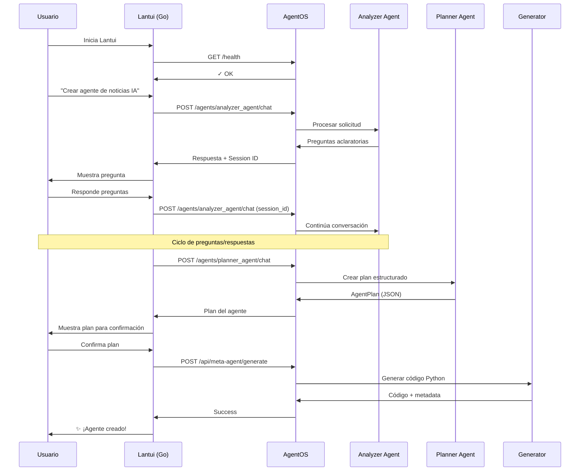

# Resumen Ejecutivo: Lantui + AgentOS

> **Propósito:** Documento breve sobre cómo Lantui se integra con AgentOS  
> **Audiencia:** Equipo de desarrollo, stakeholders  
> **Fecha:** Octubre 14, 2025

---

## 🎯 Visión General

**Lantui** es un TUI (Terminal User Interface) moderno construido en Go que proporciona una experiencia visual atractiva para interactuar con el **Meta-Agente Generador**, el cual está construido sobre **AgentOS** de Agno Framework.

```
┌─────────────────────────────────────────────────┐
│                                                 │
│              LANTUI (Go + Bubble Tea)          │
│         Terminal UI Moderna y Atractiva         │
│                                                 │
└─────────────────┬───────────────────────────────┘
                  │
                  │ HTTP/REST
                  │
┌─────────────────▼───────────────────────────────┐
│                                                 │
│         AgentOS (Python + Agno Framework)       │
│                                                 │
│  ┌──────────────────────────────────────┐      │
│  │   Meta-Agente (Orquestador)          │      │
│  ├──────────────────────────────────────┤      │
│  │   Analyzer Agent                     │      │
│  │   (Analiza solicitudes, hace         │      │
│  │    preguntas aclaratorias)           │      │
│  ├──────────────────────────────────────┤      │
│  │   Planner Agent                      │      │
│  │   (Crea plan estructurado            │      │
│  │    del agente a generar)             │      │
│  ├──────────────────────────────────────┤      │
│  │   Generator                          │      │
│  │   (Genera código Python del agente)  │      │
│  └──────────────────────────────────────┘      │
│                                                 │
│  Storage: SQLite                                │
│  ├─ Sesiones de conversación                   │
│  ├─ Memoria de usuarios                        │
│  └─ Knowledge base                             │
│                                                 │
└─────────────────────────────────────────────────┘
```

---

## 🔑 Conceptos Clave

### ¿Qué es AgentOS?

**AgentOS** es una aplicación FastAPI completa incluida en el framework Agno que proporciona:

1. **API RESTful nativa** para interactuar con agentes
2. **Gestión de sesiones** automática y persistente
3. **Storage** configurable (SQLite, PostgreSQL, etc.)
4. **Multi-agente** con coordinación entre agentes
5. **Control Plane web** (interfaz opcional en browser)
6. **Autenticación** con bearer tokens

### ¿Qué aporta Lantui?

**Lantui** complementa AgentOS con:

1. **Experiencia TUI moderna** (estilo Claude Code, Gemini Code)
2. **Interacción fluida** con animaciones y streaming
3. **Visualización atractiva** de conversaciones y planes
4. **Feedback visual rico** durante generación de código
5. **Alternativa ligera** al Control Plane web de AgentOS

---

## 🏗️ Arquitectura de Integración

### Flujo de Usuario



### Endpoints Utilizados

**AgentOS Nativos (out-of-the-box):**
- `GET /health` - Health check
- `GET /config` - Configuración del OS y agentes disponibles
- `POST /agents/{agent_id}/chat` - Chat con agente específico
- `GET /sessions` - Listar sesiones
- `GET /sessions/{session_id}` - Detalle de sesión

**Custom (añadidos al AgentOS):**
- `POST /api/meta-agent/generate` - Generar código del agente
- `POST /api/meta-agent/generate-stream` - Generación con streaming
- `GET /api/meta-agent/generated` - Listar agentes generados

---

## 📦 Componentes del Sistema

### Backend: AgentOS (Python)

**Archivo principal:** `agentos.py`

```python
from agno.agent import Agent
from agno.models.anthropic import Claude
from agno.os import AgentOS
from agno.storage.agent import SqliteAgentStorage

# Agentes
analyzer_agent = Agent(...)
planner_agent = Agent(...)

# Storage
storage = SqliteAgentStorage(
    table_name="agent_sessions",
    db_file="agents_memory.sqlite"
)

# AgentOS
agent_os = AgentOS(
    os_id="meta-agent-os-v1",
    agents=[analyzer_agent, planner_agent],
    storage=storage,
)

# Rutas custom
agent_os.app.include_router(meta_router, prefix="/api/meta-agent")

# Servir
agent_os.serve("agentos:app", port=7777)
```

**Ventajas:**
- ✅ Sesiones persistentes automáticas
- ✅ API ya documentada (OpenAPI/Swagger)
- ✅ Control Plane web opcional
- ✅ Multi-database support
- ✅ Escalable a multi-tenancy

### Frontend: Lantui (Go)

**Estructura:**
```
lantui/
├── cmd/lantui/main.go          # Entry point
├── internal/
│   ├── ui/                      # Componentes Bubble Tea
│   │   ├── screens/             # Pantallas principales
│   │   ├── components/          # Widgets reutilizables
│   │   └── styles/              # Temas y estilos
│   ├── client/                  # Cliente AgentOS
│   │   ├── agentos_client.go
│   │   └── mock_client.go
│   └── models/                  # Estructuras de datos
└── go.mod
```

**Tecnologías:**
- **Bubble Tea** - Framework TUI (Elm architecture)
- **Lipgloss** - Styling y layouts
- **Glamour** - Renderizado de Markdown
- **Bubbles** - Componentes pre-construidos

**Ventajas:**
- ✅ Performance nativa de Go
- ✅ UI moderna y atractiva
- ✅ Streaming y animaciones fluidas
- ✅ Cross-platform (Windows, macOS, Linux)
- ✅ Desarrollo paralelo con mocks

---

## 🚀 Desarrollo Paralelo

### Backend Team (Python)

**Tareas:**
1. Crear `agentos.py` con AgentOS configurado
2. Implementar `analyzer_agent` y `planner_agent`
3. Crear rutas custom en `src/infrastructure/api/meta_routes.py`
4. Testing de endpoints con pytest

**No bloqueante:** Frontend usa mock client hasta que backend esté listo.

### Frontend Team (Go)

**Tareas:**
1. Setup proyecto Go (estructura lantui/)
2. Implementar pantallas con Bubble Tea
3. Crear cliente AgentOS (interface + mock)
4. Testing con mock client

**No bloqueante:** Puede avanzar completamente con datos simulados.

### Sincronización

**Puntos de encuentro:**
1. **Contratos de API** - Definidos en `api-contracts-agentos.md`
2. **Modelos de datos** - AgentPlan, ChatRequest/Response, etc.
3. **Testing integración** - Una vez ambos componentes listos

**Reuniones:**
- Daily sync: 15 min
- Sprint review: Cada 2 semanas
- Demo conjunto: Al final de cada milestone

---

## 📊 Ventajas de esta Arquitectura

### vs. Backend Custom

| Aspecto | Backend Custom | AgentOS |
|---------|---------------|---------|
| API REST | Implementar manualmente | ✅ Incluida |
| Sesiones | Código custom | ✅ Automático |
| Storage | Setup manual | ✅ Configurable |
| Docs API | Escribir OpenAPI | ✅ Auto-generada |
| Control Plane | Construir UI web | ✅ Opcional incluida |
| Tiempo dev | ~2-3 semanas | ~3-5 días |

### vs. Solo CLI Python

| Aspecto | CLI Python | Lantui (Go) |
|---------|------------|-------------|
| Performance | Lenta (startup) | ✅ Nativa Go |
| UI | Básica (Rich) | ✅ Moderna (Bubble Tea) |
| Animaciones | Limitadas | ✅ Completas |
| Distribución | Requires Python | ✅ Binary único |
| Mantenibilidad | Acoplada | ✅ Desacoplada |

---

## 🎯 Roadmap

### Fase 1: MVP Backend (1-2 semanas)
- [ ] `agentos.py` funcional
- [ ] `analyzer_agent` y `planner_agent` operativos
- [ ] Rutas custom `/api/meta-agent/generate`
- [ ] Tests básicos

### Fase 2: MVP Frontend (2-3 semanas)
- [ ] Setup proyecto Go
- [ ] Pantallas: Welcome, Conversation, Plan Review, Generation, Success
- [ ] Mock client funcional
- [ ] Navegación completa

### Fase 3: Integración (1-2 semanas)
- [ ] Cliente Go para AgentOS real
- [ ] Tests end-to-end
- [ ] Manejo de errores
- [ ] Streaming funcional

### Fase 4: Polish (1-2 semanas)
- [ ] Temas visuales
- [ ] Atajos de teclado
- [ ] Historial de agentes generados
- [ ] Documentación de usuario

**Total:** ~2 meses para v1.0

---

## ✅ Checklist de Inicio

### Backend
- [ ] Revisar y aprobar `api-contracts-agentos.md`
- [ ] Crear `agentos.py` en raíz del proyecto
- [ ] Mover lógica de `meta_agent.py` a agentes separados
- [ ] Crear `src/infrastructure/api/meta_routes.py`
- [ ] Tests de endpoints

### Frontend
- [ ] Crear carpeta `lantui/` en raíz
- [ ] Inicializar `go mod init`
- [ ] Implementar primera pantalla (Welcome)
- [ ] Crear mock client
- [ ] Tests de UI

### Documentación
- [x] Plan de desarrollo
- [x] Contratos de API
- [x] Guía de setup
- [x] Guía de estilo
- [ ] Tutorial de uso

---

## 📞 Contacto y Recursos

**Documentación Completa:** `doc-frontend/`
- Plan detallado: `plan-desarrollo-lantui.md`
- API contracts: `api-contracts-agentos.md`
- Setup: `setup-inicial.md`
- Estilo Go: `guia-estilo-go.md`

**Referencias Externas:**
- [Agno Docs](https://docs.agno.com)
- [AgentOS Guide](https://docs.agno.com/agent-os)
- [Bubble Tea](https://github.com/charmbracelet/bubbletea)

**Team:**
- Backend Lead: Python + Agno
- Frontend Lead: Go + Bubble Tea
- Coordinación: Desarrollo paralelo

---

**¿Preguntas?** Consulta la documentación completa o contacta al equipo.

**Última actualización:** Octubre 14, 2025

